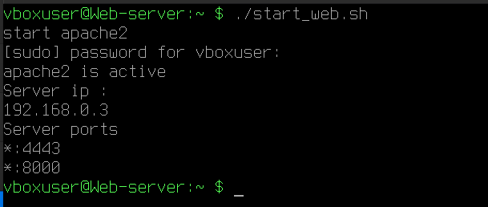
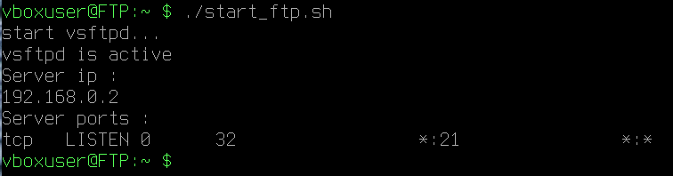

# 1. Introduction
This lab simulate a small enterprise network protected by linux firewall.
The goal is to isolate public services inside DMZ , while protecting the internal network.

# 2. Network Architecture 

## Topology


## Subnets

| Network | Subnet | Purpose |
|---------|------------|------------|
| WAN | 172.17.0.0/24 | Internet |
| DMZ | 192.168.0.0/24 | Public servers |
| Admin | 192.168.1.0/24 | Administration |
| Employees | 192.168.2.0/24 | Internal users |

## Firewall Interfaces

| Interface | IP | Role |
|------------|-------------|-------------|
| eth0 | 172.17.0.1 | Internet |
| eth1 | 192.168.0.1 | DMZ |
| eth2 | 192.168.1.1 | Admin |
| eth3 | 192.168.2.1 | Employees |

## Virtual Machines


# 3. Setup Services

## Web Server

The web server is hosted inside the DMZ network .

It listens on :
- HTTP 8000
- HTTPS 4443

We use custom port insted of 80/443 to simulate port forwarding through Nat.

### start service

```bash

./services/start_web.sh

```



## FTP Serveri

The FTP server is also hosted inside the DMZ netwok.

It listens on : 
- FTP 21

### Start service 

```bash 

./services/start_ftp.sh

```



# 4. Firewall configuration 

Default security policy DROP everything.

## 4.1 Default Policies

```bash 
iptables -P INPUT DROP
iptables -P FORWARD DROP
iptables -P OUTPUT ACCEPT

```
This command for block all packet incomming and forwarding by default, accept only the output . the reason is always verify and never trust .

## 4.2 Connection Tracking

```bash
iptables -A INPUT -m conntrack --ctstate ESTABLISHED,RELATED -j ACCEPT
iptables -A FORWARD -m conntrack --ctstate ESTABLISHED,RELATED -j ACCEPT

```
This rules allow incoming packets that belong to established or related connection.

### Options

| Option | Meaning |
|--------|---------|
| `-A` | Append a rule to a chain |
| `INPUT` | Incoming traffic to the host |
| `FORWARD` | Traffic routed through the host |
| `-m conntrack` | Use the connection tracking module |
| `--ctstate` | Match connection states |
| `ESTABLISHED` | Part of an already open connection |
| `RELATED` | Related with an existing connection |
| `-j ACCEPT` | Allow the packet |

 
