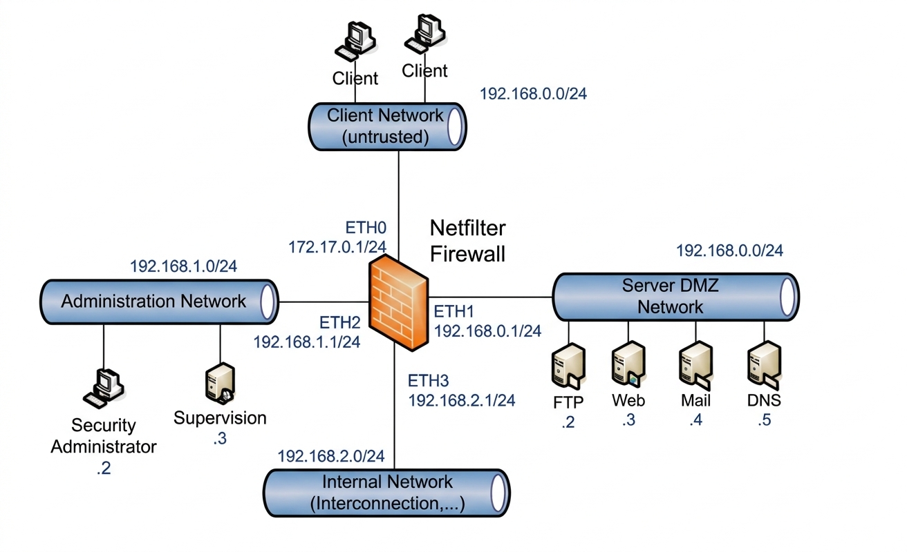
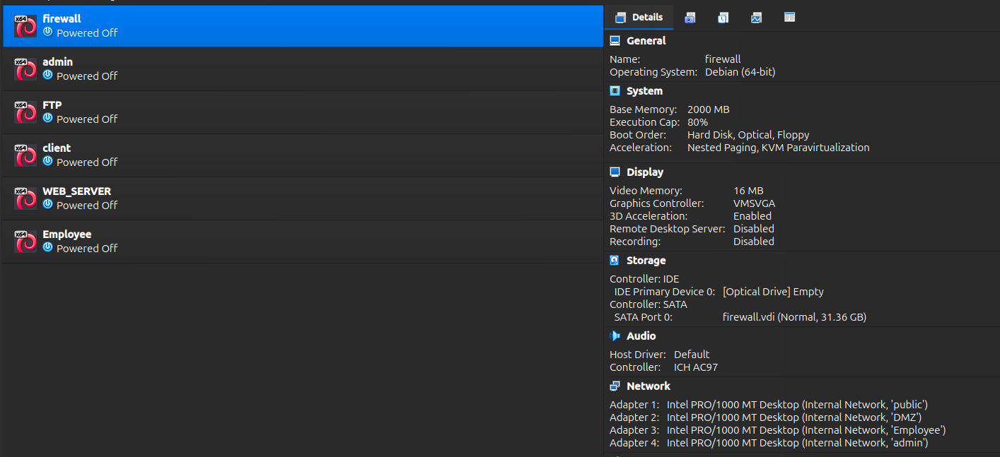

# 1. Introduction
This lab simulate a small enterprise network protected by linux firewall.
The goal is to isolate public services inside DMZ , while protecting the internal network.

# 2. Network Architecture 

## Topology

## Subnets

| Network | Subnet | Purpose |
|---------|------------|------------|
| WAN | 172.17.0.0/24 | Internet |
| DMZ | 192.168.0.0/24 | Public servers |
| Admin | 192.168.1.0/24 | Administration |
| Employees | 192.168.2.0/24 | Internal users |

## Firewall Interfaces

| Interface | IP | Role |
|------------|-------------|-------------|
| eth0 | 172.17.0.1 | Internet |
| eth1 | 192.168.0.1 | DMZ |
| eth2 | 192.168.1.1 | Admin |
| eth3 | 192.168.2.1 | Employees |

## Virtual Machines

