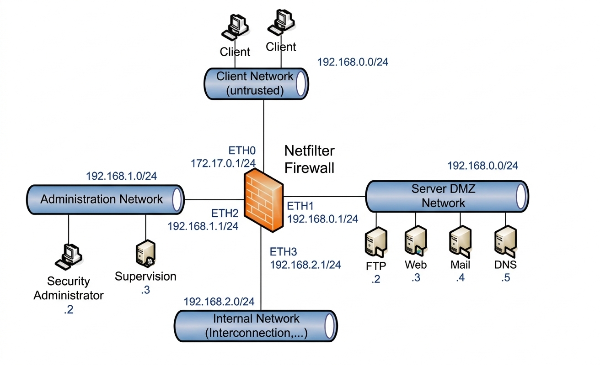
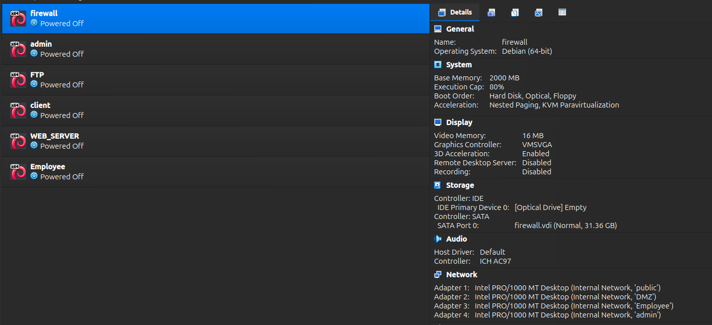
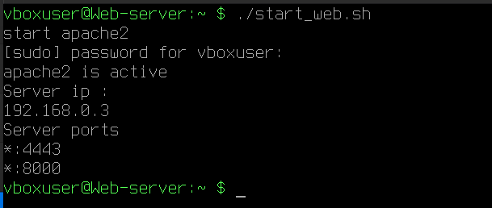
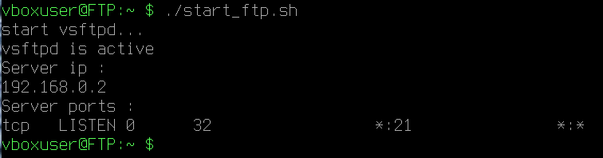
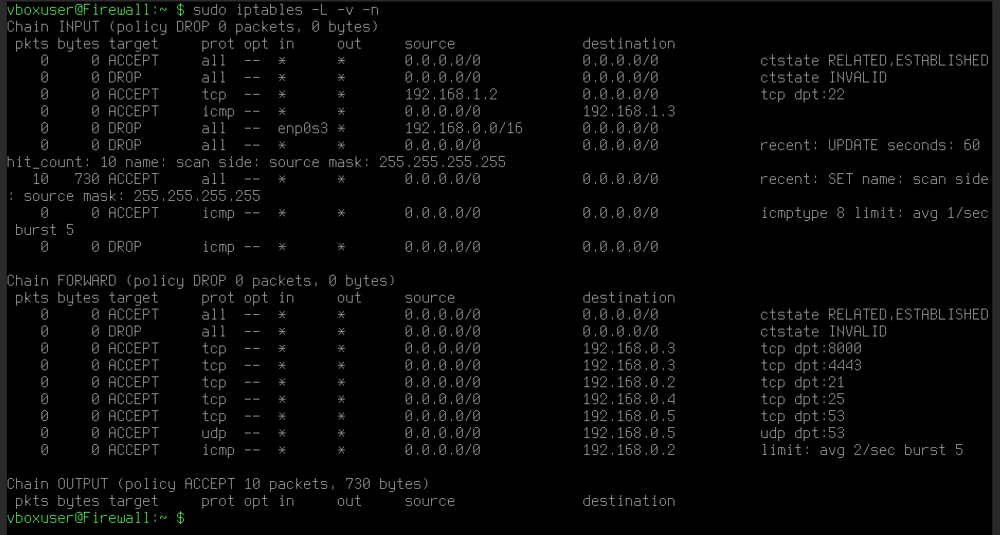
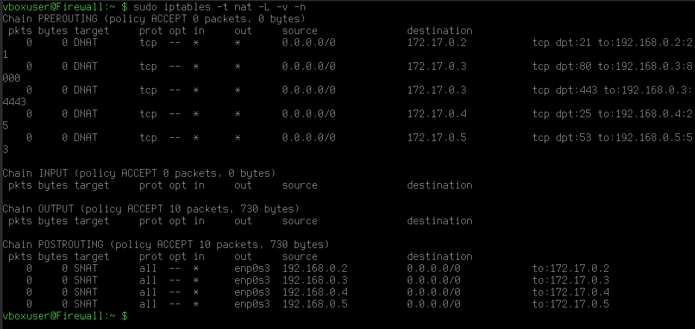

# 1. Introduction
This lab simulate a small enterprise network protected by linux firewall.
The goal is to isolate public services inside DMZ , while protecting the internal network.

# 2. Network Architecture 

## Topology



## Subnets

| Network | Subnet | Purpose |
|---------|------------|------------|
| WAN | 172.17.0.0/24 | Internet |
| DMZ | 192.168.0.0/24 | Public servers |
| Admin | 192.168.1.0/24 | Administration |
| Employees | 192.168.2.0/24 | Internal users |

## Firewall Interfaces

| Interface | IP | Role |
|------------|-------------|-------------|
| eth0 | 172.17.0.1 | Internet |
| eth1 | 192.168.0.1 | DMZ |
| eth2 | 192.168.1.1 | Admin |
| eth3 | 192.168.2.1 | Employees |

## Virtual Machines



# 3. Setup Services

## Web Server

The web server is hosted inside the DMZ network .

It listens on :
- HTTP 8000
- HTTPS 4443

We use custom port insted of 80/443 to simulate port forwarding through Nat.

### start service

```bash

./services/start_web.sh

```



## FTP Serveri

The FTP server is also hosted inside the DMZ netwok.

It listens on : 
- FTP 21

### Start service 

```bash 

./services/start_ftp.sh

```



# 4. Firewall configuration 

Default security policy DROP everything.

## 4.1 Default Policies

```bash 
iptables -P INPUT DROP
iptables -P FORWARD DROP
iptables -P OUTPUT ACCEPT

```
Block all incomming traffic . 
Block forwording.
Allow firewall outbound updates.

## 4.2 Connection Tracking

```bash
iptables -A INPUT -m conntrack --ctstate ESTABLISHED,RELATED -j ACCEPT
iptables -A FORWARD -m conntrack --ctstate ESTABLISHED,RELATED -j ACCEPT

iptables -A FORWARD -p udp -d 192.168.0.5 --dport 53 -j ACCEPT
iptables -A FORWARD -p tcp -d 192.168.0.5 --dport 53 -j ACCEPT

```
These rules allow incoming packets that belong to established or related connection. And drop invalid packets.

### Options

| Option | Meaning |
|--------|---------|
| `-A` | Append a rule to a chain |
| `INPUT` | Incoming traffic to the host |
| `FORWARD` | Traffic routed through the host |
| `-m conntrack` | Use the connection tracking module |
| `--ctstate` | Match connection states |
| `ESTABLISHED` | Part of an already open connection |
| `RELATED` | Related with an existing connection |
| `-j ACCEPT` | Allow the packet |

## 4.3 HTTP/HTTPS Access

```bash
iptables -A FORWARD -p tcp --dport 8000 -d 192.168.0.3 -j ACCEPT
iptables -A FORWARD -p tcp --dport 4443 -d 192.168.0.3 -j ACCEPT 

```
These rules allow tcp traffic with destination port is 8000 and 4443 to the host 192.168.0.3.

### Options

| Option | Meaning |
|--------|---------|
| `-A` | Append a rule to a chain |
| `FORWARD` | Traffic routed through the host |
| `-p tcp` | match Tcp port |
| `--dport` | Destination port |
| `-d` | Destination ip address |
| `-j ACCEPT` | Allow the packet |

## 4.4 FTP Access

```bash
iptables -A FORWARD -p tcp --dport 21 -d 192.168.0.2 -j ACCEPT

```
This rule allow tcp traffic to port 21.

## 4.5 SMTP Access

```bash
iptables -A FORWARD -p tcp --dport 25 -d 192.168.0.4 -j ACCEPT

``` 
This rule for allow port 25 .

## 4.6 DNS Access

```bash
iptables -A FORWARD -p udp -d 192.168.0.5 --dport 53 -j ACCEPT
iptables -A FORWARD -p tcp -d 192.168.0.5 --dport 53 -j ACCEPT

``` 
This rule for allow port 53 .

## 4.7 ICMP

```bash
iptables -A FORWARD -p icmp -j ACCEPt

```
Allow ping to serveur DMZ.

```bash
iptables -A FORWARD -p icmp -d 192.168.0.2 -m limit --limit 2/second -j ACCEPT

```
Allow only 2 packets per second to server FTP.

### Options

| Option | Meaning |
|--------|---------|
| `-p icmp` | match icmp |
| `-m limit` | Use limit module |
| `--limit 2/second` | allow 2 packets per second |

## 4.8 SSH Administration

```bash
iptables -A INPUT -p tcp --dport 22 -s 192.168.1.2 -j ACCEPT

```
Only the admin PC can manage the firewall.

## 4.9 ICMP Supervision

```bash 
iptables -A INPUT -p icmp -s 192.168.1.3 -j ACCEPT

```
Allow ping from supervision.

## 4.10 Anti-Spoofing

```bash
iptables -A INPUT -i eth0 -s 192.168.0.0/16 -j DROP

```
Block private ip that coming from eth0.

## 4.11 Port scan

```bash
iptables -A INPUT -m recent --name scan --update --seconds 60 --hitcount 10 -j DROP
iptables -A IMPUT -m recent --set -j ACCEPT

```
If the IP hit 10 times in 60 seconds , match this rule.

### Options

| Option | Meaning |
|--------|---------|
| `-m recent` | Use limit module |
| `--name` | name for recent list |
| `--update` |  check if the IP is already in the list |
| `--seconds 60` | look at last 60 seconds |
| `--hitcount 10` | if the ip hit 10 time |
| `--set` | add the ip to the list |

## 4.12 Ping of death

```bash
iptables -A INPUT -p icmp --icmp-type echo-request -m limit --limit 1/s -j ACCEPT
iptables -A INPUT -p icmp -j DROP

```
These rules allow 1 icmp request per second.

# 5. Nat configuration

Network Address Translation(NAT) is a technique used by routers to allow multiple devices on a private network to share a single public ip.

## 5.1 HTTP/HTTPS

```bash
iptables -t nat -A PREROUTING -p tcp --dport 80 -d 172.17.0.3 -j DNAT --to-destination 192.168.0.3:8000
iptables -t nat -A PREROUTING -p tcp --dport 443 -d 172.17.0.3 -j DNAT --to-destination 192.168.0.3:4443

iptables -t nat -A POSTROUTING -s 192.168.0.3 -o eth0 -j SNAT --to-source 172.17.0.3

```
Incomming traffic to 172.17.0.3:80 or 443 is redirected to the internal server 192.168..0.3 on ports 8000 and 4443. The server processes the request and send the replay back through the firewall. The firewall changes the source IP (Snat) to 172.17.0.2 .

## 5.2 FTP

```bash
iptables -t nat -A PREROUTING -p tcp --dport 21 -d 172.17.0.2 -j DNAT --to-destination 192.168.0.2:21
iptables -t nat -A POSTROUTING -s 192.168.0.2 -o eth0 -j SNAT --to-source 172.17.0.2

```
The client thinks it is communicating with the public server.

## 5.3 SMTP

```bash
iptables -t nat -A PREROUTING -p tcp --dport 25 -d 172.17.0.4 -j DNAT --to-destination 192.168.0.4:25
iptables -t nat -A POSTROUTING -s 192.168.0.4 -o eth0 -j SNAT --to-source 172.17.0.4

```
Incomming traffic to 172.17.0.4:21 is redirected to 192.168.0.4 .

## 5.4 DNS

```bash
iptables -t nat -A PREROUTING -p tcp --dport 53 -d 172.17.0.5 -j DNAT --to-destination 192.168.0.5:53
iptables -t nat -A POSTROUTING -s 192.168.0.5 -o eth0 -j SNAT --to-source 172.17.0.5

```

# 6. Testing & Validation

## 6.1 Firewall Rules 



## 6.2 Nat Rules




